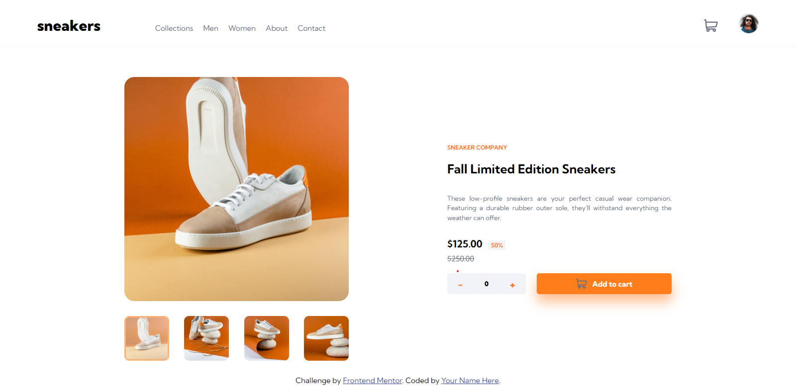

# Frontend Mentor - E-commerce product page solution

This is a solution to the [E-commerce product page challenge on Frontend Mentor](https://www.frontendmentor.io/challenges/ecommerce-product-page-UPsZ9MJp6). Frontend Mentor challenges help you improve your coding skills by building realistic projects.

## Table of contents

- [Overview](#overview)
  - [The challenge](#the-challenge)
  - [Screenshot](#screenshot)
  - [Links](#links)
- [My process](#my-process)
  - [Built with](#built-with)
  - [What I learned](#what-i-learned)
  - [Continued development](#continued-development)
  - [Useful resources](#useful-resources)
- [Author](#author)
- [Acknowledgments](#acknowledgments)


## Overview

### The challenge

Users should be able to:

- View the optimal layout for the site depending on their device's screen size
- See hover states for all interactive elements on the page
- Open a lightbox gallery by clicking on the large product image
- Switch the large product image by clicking on the small thumbnail images
- Add items to the cart
- View the cart and remove items from it

### Screenshot



### Links

- Solution URL: [Add solution URL here](https://your-solution-url.com)
- Live Site URL: [Add live site URL here](https://your-live-site-url.com)

## My process

### Built with

- Semantic HTML5 markup
- CSS custom properties
- Flexbox
- CSS Grid
- Mobile-first workflow
- Vanilla JavaScript

### What I learned

Making carousels was a major thing I needed to learn while creating this project. I thought I had a pretty good grasp on building them before starting, however the knowledge I had from tutorials was a bit rusty. Responsive web design was also something I struggled with a quite a lot, but hopefully I've gotten the hang of it now.


```js
let couter = 0;
const proudOfThisFunc = () => {
      if(counter === productMainImages.length){
        counter = 0;
      }
      if(counter < 0){
          counter = productMainImages.length - 1;
      }
      if(innerWidth <= 778){
          productMainImages.forEach(productMainImage =>{
              productMainImage.style.transform = `translateX(-${counter * 100}%)`;
          })
      }
      else{
          lightboxMainImages.forEach(lightboxMainImage => {
              lightboxMainImage.style.transform = `translateX(-${counter * 100}%)`;
          })
          selectedImgStyleFunction(counter, lightboxImgSelectors);
      }
}
```

### Continued development

Learning how to work better with SVG files is definitely something I intend to focus on. In future projects I also intend to try and make my JavaScript code more concise and reusable.

### Useful resources

- [FreeCodeCamp](https://www.freecodecamp.org) - This helped me to understand some JavaScript concepts. I really liked this pattern and will use it going forward.

## Author
- Frontend Mentor - [@Ihezie](https://www.frontendmentor.io/profile/Ihezie)

## Acknowledgments
Many thanks to the youtube channel freeCodeCamp. Without the help of their tutorial videos, I definitely would not have been able to build the lightbox gallery.
